# Terraform KinD API Deployment

This project demonstrates how to deploy a simple FastAPI application on a local Kubernetes-in-Docker (KinD) cluster using Terraform, behind an NGINX Ingress controller.

## Project Structure

```
.
├── api/
│   ├── app.py              # FastAPI application
│   ├── Dockerfile          # Container definition
│   └── requirements.txt    # Python dependencies
├── terraform/
│   ├── main.tf            # Main Terraform configuration
│   ├── providers.tf       # Provider configurations
│   ├── variables.tf       # Variable definitions
│   ├── app/               # App module
│   │   ├── deployment.tf  # Kubernetes deployment
│   │   ├── service.tf     # Kubernetes service
│   │   ├── ingress.tf     # Kubernetes ingress
│   │   └── variables.tf   # App module variables
│   └── ingress/
│       └── nginx.tf       # NGINX Ingress controller
└── README.md              # This file
```

## Prerequisites

- [Docker](https://docs.docker.com/get-docker/) installed and running
- [kind](https://kind.sigs.k8s.io/docs/user/quick-start/#installation) installed
- [kubectl](https://kubernetes.io/docs/tasks/tools/install-kubectl/) installed
- [Terraform](https://developer.hashicorp.com/terraform/tutorials/aws-get-started/install-cli) installed

## API Endpoints

The FastAPI application provides the following endpoints:

- `GET /health` - Health check endpoint
- `GET /time` - Returns current epoch time
- `POST /echo` - Echoes back JSON payload with pod information

## Deployment Steps

### 1. Build the Docker Image

Build the API container image that will be deployed to KinD:

```bash
docker build -t local/api:dev api/
```

### 2. Create KinD Cluster

Create a KinD cluster named `tf-kind`:

```bash
kind create cluster --name tf-kind
```

Verify the cluster is running:

```bash
kind get clusters # should see tf-kind
```

Set kubectl context to the new cluster:

```bash
kubectl config use-context kind-tf-kind
```

### 3. Load Docker Image into KinD

Load the locally built image into the KinD cluster:

```bash
kind load docker-image local/api:dev --name tf-kind
```

### 4. Initialize and Apply Terraform

Navigate to the terraform directory:

```bash
cd terraform
```

Initialize Terraform:

```bash
terraform init
```

Review the planned changes:

```bash
terraform plan
```

Apply the configuration:

```bash
terraform apply
```

When prompted, type `yes` to confirm the deployment.

### 5. Set Up Port Forwarding

Since KinD runs in Docker, set up port forwarding to access the application:

```bash
kubectl port-forward -n ingress-nginx service/nginx-ingress-ingress-nginx-controller 8080:80
```

Keep this terminal open while testing the application.

### 6. Test the Application

Open a new terminal and test the API endpoints:

**Health Check:**
```bash
curl http://localhost:8080/health
```

**Time Endpoint:**
```bash
curl http://localhost:8080/time
```

**Echo Endpoint:**
```bash
curl -X POST http://localhost:8080/echo \
  -H "Content-Type: application/json" \
  -d '{"message": "Hello from Terraform and KinD!"}'
```

**Browser Access:**

You can also access the endpoints in your browser:
- http://localhost:8080/health
- http://localhost:8080/time


## Verification Commands

Check that all resources are running:

```bash
# Check all pods
kubectl get pods -A

# Check services
kubectl get svc -A

# Check ingress
kubectl get ingress

# Check NGINX ingress controller
kubectl get pods -n ingress-nginx
```

## Cleanup Steps

Follow these steps in order to properly terminate all deployments and clean up resources:

### 1. Stop Port Forwarding

In the terminal running port forwarding, press `Ctrl+C` to stop it:

```bash
# If port forwarding is running in foreground, press Ctrl+C
# If running in background, find and kill the process:
ps aux | grep "kubectl port-forward"
kill <process_id>
```

### 2. Verify Current Deployments

Before cleanup, check what's currently running:

```bash
# Check all resources in the cluster
kubectl get all -A

# Check specifically the API deployment
kubectl get pods,svc,ingress -o wide

# Check NGINX ingress controller
kubectl get pods -n ingress-nginx
```

### 3. Manual Deployment Cleanup (Alternative to Terraform)

If you want to manually delete specific deployments without using Terraform destroy:

```bash
# Delete the API resources
kubectl delete deployment api
kubectl delete service api-svc
kubectl delete ingress api-ing

# Delete the NGINX ingress controller (if installed via kubectl)
kubectl delete namespace ingress-nginx

# Or if using Helm directly:
helm uninstall nginx-ingress -n ingress-nginx
```

### 4. Destroy Terraform Resources (Recommended)

Navigate to terraform directory and destroy all resources:

```bash
cd terraform
terraform destroy
```

When prompted, type `yes` to confirm the destruction.

**Verify cleanup:**
```bash
# Check that resources are being terminated
kubectl get pods -A

# Check Terraform state
terraform show
```

### 5. Stop and Delete the KinD Cluster

**Option A: Delete the cluster (removes everything):**
```bash
kind delete cluster --name tf-kind
```

**Option B: Just stop the cluster containers (preserves cluster for later):**
```bash
# Stop the cluster container
docker stop tf-kind-control-plane

# Start it again later if needed
docker start tf-kind-control-plane
```

**Verify cluster deletion:**
```bash
# Check that cluster is gone
kind get clusters

# Verify Docker containers are removed
docker ps -a | grep tf-kind
```

### 6. Clean Up Docker Images (Optional)

Remove the locally built images:

```bash
# Remove your custom API image
docker rmi local/api:dev

# Remove KinD node images (optional - saves disk space)
docker rmi kindest/node:v1.29.2

# Clean up all unused Docker resources
docker system prune -f
```

### 7. Reset kubectl Context (Optional)

If you have other Kubernetes clusters, switch context:

```bash
# List available contexts
kubectl config get-contexts

# Switch to another context
kubectl config use-context <other-context>

# Or remove the KinD context entirely
kubectl config delete-context kind-tf-kind
kubectl config delete-cluster kind-tf-kind
```

## Quick Cleanup Script

For convenience, here's a one-liner to clean everything up:

```bash
# Stop port forwarding (if running), destroy Terraform, delete cluster
pkill -f "kubectl port-forward" ; cd terraform && terraform destroy -auto-approve ; cd .. && kind delete cluster --name tf-kind && docker rmi local/api:dev
```

**⚠️ Warning:** This will destroy everything without confirmation prompts!

## Troubleshooting

### Common Issues

1. **Docker image not found in KinD:**
   - Ensure you've loaded the image: `kind load docker-image local/api:dev --name tf-kind`

2. **Terraform provider errors:**
   - Make sure KinD cluster is running: `kind get clusters`
   - Verify kubectl context: `kubectl config current-context`

3. **Port forwarding connection refused:**
   - Check if NGINX ingress controller is running: `kubectl get pods -n ingress-nginx`
   - Wait for the pod to be in `Running` state

4. **API endpoints return 404:**
   - Verify ingress is created: `kubectl get ingress`
   - Check ingress controller logs: `kubectl logs -n ingress-nginx deployment/nginx-ingress-ingress-nginx-controller`

### Useful Debug Commands

```bash
# Check cluster info
kubectl cluster-info

# View pod logs
kubectl logs deployment/api

# Describe ingress
kubectl describe ingress api-ing

# Check events
kubectl get events --sort-by='.lastTimestamp'
```

## Architecture

This deployment creates:

1. **KinD Cluster**: Local Kubernetes cluster running in Docker
2. **API Deployment**: 2 replicas of the FastAPI application
3. **Service**: ClusterIP service exposing the API internally
4. **NGINX Ingress Controller**: Deployed via Helm in `ingress-nginx` namespace
5. **Ingress Resource**: Routes external traffic to the API service

### Infrastructure Diagram

```mermaid
graph TB
    subgraph "Host Machine"
        User[👤 User]
        Browser[🌐 Browser]
        Terminal[💻 Terminal/curl]
        Docker[🐳 Docker Engine]
    end
    
    subgraph "KinD Cluster (tf-kind)"
        subgraph "Docker Container: tf-kind-control-plane"
            subgraph "Kubernetes Control Plane"
                API_Server[🎛️ API Server]
                ETCD[🗃️ etcd]
                Scheduler[📋 Scheduler]
                Controller[🎮 Controller Manager]
            end
            
            subgraph "ingress-nginx namespace"
                IngressController[🚦 NGINX Ingress Controller<br/>nginx-ingress-ingress-nginx-controller<br/>Port: 80/443<br/>NodePort: 30080/30443]
            end
            
            subgraph "default namespace"
                subgraph "API Deployment"
                    Pod1[🐍 API Pod 1<br/>api-6d7dfb76dc-xxxxx<br/>Container: local/api:dev<br/>Port: 8080]
                    Pod2[🐍 API Pod 2<br/>api-6d7dfb76dc-yyyyy<br/>Container: local/api:dev<br/>Port: 8080]
                end
                
                Service[⚖️ ClusterIP Service<br/>api-svc<br/>Port: 8080]
                IngressResource[📋 Ingress Resource<br/>api-ing<br/>Rules: / → api-svc:8080]
            end
        end
    end
    
    %% Traffic Flow Connections
    User --> Browser
    User --> Terminal
    
    Browser -->|HTTP Request<br/>localhost:8080/health| PortForward
    Terminal -->|curl localhost:8080/time| PortForward
    
    PortForward[🔀 kubectl port-forward<br/>8080:80] -->|Forwards to| IngressController
    
    IngressController -->|Routes based on<br/>Ingress rules| IngressResource
    IngressResource -->|Backend service| Service
    Service -->|Load balances| Pod1
    Service -->|Load balances| Pod2
    
    %% Docker relationship
    Docker -.->|Runs| KinD_Container[KinD Container]
    
    %% Terraform management
    Terraform[🏗️ Terraform] -.->|Manages| IngressController
    Terraform -.->|Manages| Pod1
    Terraform -.->|Manages| Pod2
    Terraform -.->|Manages| Service
    Terraform -.->|Manages| IngressResource
    
    %% Response flow (dotted lines)
    Pod1 -.->|JSON Response| Service
    Pod2 -.->|JSON Response| Service
    Service -.->|Response| IngressResource
    IngressResource -.->|Response| IngressController
    IngressController -.->|Response| PortForward
    PortForward -.->|Response| Browser
    PortForward -.->|Response| Terminal
    
    %% Styling
    classDef userClass fill:#e1f5fe,stroke:#01579b,stroke-width:2px
    classDef k8sClass fill:#f3e5f5,stroke:#4a148c,stroke-width:2px
    classDef podClass fill:#e8f5e8,stroke:#1b5e20,stroke-width:2px
    classDef ingressClass fill:#fff3e0,stroke:#e65100,stroke-width:2px
    classDef terraformClass fill:#fce4ec,stroke:#880e4f,stroke-width:2px
    
    class User,Browser,Terminal userClass
    class API_Server,ETCD,Scheduler,Controller,Service,IngressResource k8sClass
    class Pod1,Pod2 podClass
    class IngressController,PortForward ingressClass
    class Terraform terraformClass
```



### Traffic Flow Sequence

```mermaid
sequenceDiagram
    participant U as 👤 User
    participant B as 🌐 Browser
    participant PF as 🔀 Port Forward
    participant IC as 🚦 NGINX Ingress
    participant IR as 📋 Ingress Resource
    participant SVC as ⚖️ Service (api-svc)
    participant P1 as 🐍 API Pod 1
    participant P2 as 🐍 API Pod 2
    
    Note over U,P2: GET /health Request Flow
    
    U->>B: Open localhost:8080/health
    B->>PF: HTTP GET localhost:8080/health
    Note over PF: kubectl port-forward<br/>8080:80
    PF->>IC: Forward to port 80
    Note over IC: NGINX Ingress Controller<br/>ingress-nginx namespace
    IC->>IR: Check routing rules
    Note over IR: Path: / → api-svc:8080
    IR->>SVC: Route to backend service
    Note over SVC: ClusterIP Service<br/>Load balancer
    
    alt Load balance to Pod 1
        SVC->>P1: Forward request
        Note over P1: FastAPI app on port 8080
        P1->>SVC: {"status": "ok"}
    else Load balance to Pod 2
        SVC->>P2: Forward request
        Note over P2: FastAPI app on port 8080
        P2->>SVC: {"status": "ok"}
    end
    
    SVC->>IR: Return response
    IR->>IC: Forward response
    IC->>PF: HTTP response
    PF->>B: JSON response
    B->>U: Display: {"status": "ok"}
    
    Note over U,P2: Complete request-response cycle
```



### Component Details

| Component | Type | Purpose | Access |
|-----------|------|---------|---------|
| **User** | Human | Initiates requests | Browser/Terminal |
| **kubectl port-forward** | Process | Tunnel traffic into cluster | localhost:8080 → pod:80 |
| **NGINX Ingress Controller** | Pod | HTTP/HTTPS proxy and load balancer | Deployed via Helm |
| **Ingress Resource** | K8s Object | Routing rules configuration | Path-based routing |
| **Service (api-svc)** | K8s Object | Internal load balancer | ClusterIP, port 8080 |
| **API Pods** | Containers | FastAPI application instances | 2 replicas, local/api:dev |

The traffic flow is:
```
Browser → localhost:8080 → Port Forward → NGINX Ingress Controller → API Service → API Pods
```

## Security Notes

- This setup is for local development/demonstration only
- The KinD cluster is not secured for production use
- No TLS/SSL certificates are configured
- All traffic is HTTP (not HTTPS)

## Next Steps

To enhance this deployment for production:

1. Add TLS certificates for HTTPS
2. Implement proper secret management
3. Add monitoring and logging
4. Configure resource limits and requests
5. Add network policies
6. Implement CI/CD pipeline
